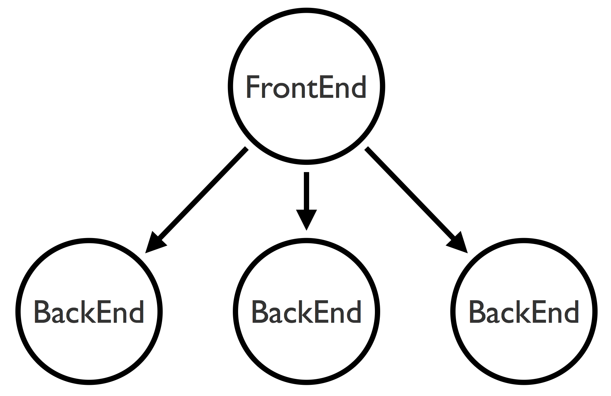

Introduction
===================
The picture below shows the actors ecosystem withinin the application.
 
 

The FrontEnd utilises akka's inbuilt routing strategy through a configurable load balancer. The adaptive load balancing is based on cluster metrics is used for BackEnd node selection. 

Routing decisions are based on system's health data such as 

 1. Used and maximum JVM heap memory
 2. System load
 3. CPU utilisation

In the configuration file, minimum number of members of a certain role is defined, for a leader to change 'joining' member status to 'up'. 